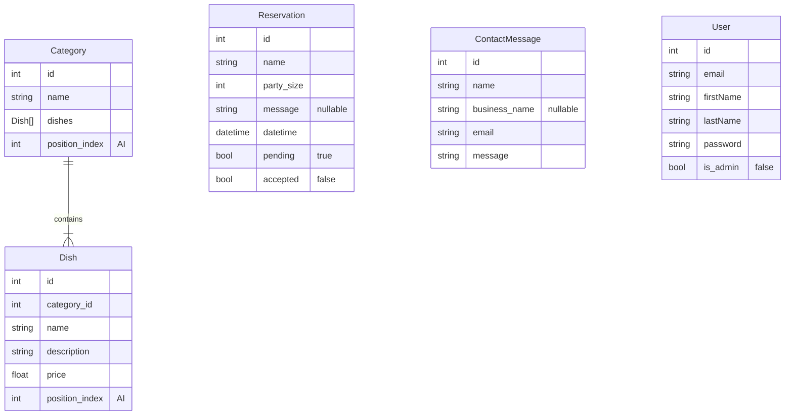

# Thuisbezorgd software design document

## Database design

position_index is used to order the items in the frontend.

## API design

### Menu

| Endpoint                                    | Method | Description                            | Admin only |
|---------------------------------------------|--------|----------------------------------------|------------|
| /menu                                       | GET    | Get all Categories                     | ❌          |
| /menu/category                              | POST   | Add a category                         | ✔️         |
| /menu/category/{category}                   | PUT    | Update a category                      | ✔️         |
| /menu/category/{category}                   | DELETE | Delete a category                      | ✔️         |
| /menu/category/swap/{category1}/{category2} | PATCH  | Swap two categories from positionIndex | ✔️         |
| /menu/dish                                  | POST   | Add a dish                             | ✔️         |
| /menu/dish/{dish}                           | PUT    | Update a dish                          | ✔️         |
| /menu/dish/{dish}                           | DELETE | Delete a dish                          | ✔️         |
| /menu/dish/swap/{dish}/{dish}               | PATCH  | Swap two dishes from positionIndex     | ✔️         |

Controllers: CategoryController, DishController

### Contact and reservations

| Endpoint                            | Method | Description              | Admin only |
|-------------------------------------|--------|--------------------------|------------|
| /contact                            | GET    | Get all contact messages | ✔️         |
| /contact                            | POST   | Send a contact message   | ❌          |
| /contact/{contactMessage}           | DELETE | Delete a contact message | ✔️         |
| /reservations                       | GET    | Get all reservations     | ✔️         |
| /reservations                       | POST   | Make a reservation       | ❌          |
| /reservations/accept/{reservation}  | PATCH  | Accept reservation       | ✔️         |
| /reservations/decline/{reservation} | PATCH  | Decline reservation      | ✔️         |

Controllers: ContactController, ReservationsController

### Account

All public endpoints

| Endpoint       | Method | Description               |
|----------------|--------|---------------------------|
| /auth/register | POST   | Create a account          |
| /auth/login    | GET    | Login as a admin          |
| /auth/logout   | GET    | Logout                    |
| /auth/check    | GET    | Check if a token is valid |

Controllers: AuthController

### Manage Admins

These endpoints are all admin only

| Endpoint      | Method | Description                |
|---------------|--------|----------------------------|
| /users        | GET    | Get all users              |
| /admin/{user} | POST   | Promote a user to admin    |
| /admin/{user} | DELETE | Demote a user from admin   |

Controllers: AdminController
