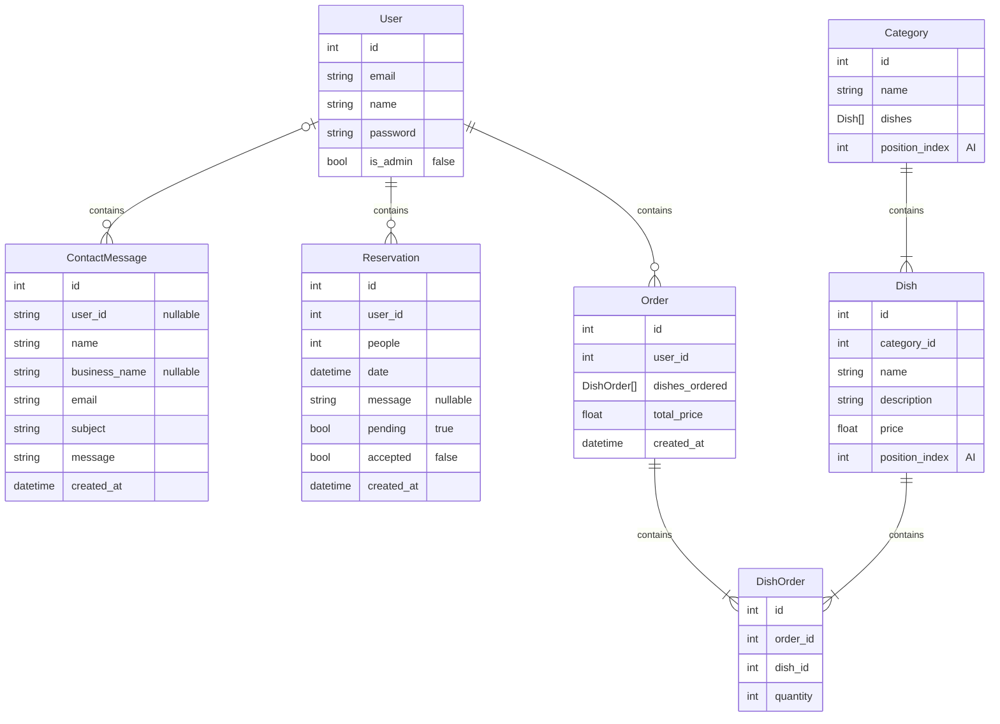

# Software design document

## Database design

position_index is used to order the items in the frontend.

## API design

### Menu

| Endpoint                                    | Method | Description                             | Required roles |
|---------------------------------------------|--------|-----------------------------------------|----------------|
| /menu                                       | GET    | Get all Categories                      | Public         |
| /menu/category                              | POST   | Add a category                          | Admin️         |
| /menu/category/{category}                   | PUT    | Update a category                       | Admin️         |
| /menu/category/{category}                   | DELETE | Delete a category                       | Admin️         |
| /menu/category/swap/{category1}/{category2} | PATCH  | Swap two categories from position_index | Admin️         |
| /menu/dish                                  | POST   | Add a dish                              | Admin️         |
| /menu/dish/{dish}                           | PUT    | Update a dish                           | Admin️         |
| /menu/dish/{dish}                           | DELETE | Delete a dish                           | Admin️         |
| /menu/dish/swap/{dish}/{dish}               | PATCH  | Swap two dishes from position_index     | Admin️         |

Controllers: MenuController, CategoryController, DishController

### Orders

| Endpoint | Method | Description    | Required roles |
|----------|--------|----------------|----------------|
| /orders  | POST   | Make a order   | Customer       |
| /orders  | GET    | Get all orders | Admin️         |

Controllers: OrderController

### Contact Endpoints

| Endpoint                            | Method | Description              | Required Roles |
|-------------------------------------|--------|--------------------------|----------------|
| /contact                            | GET    | Get all contact messages | Admin️         |
| /contact                            | POST   | Send a contact message   | Public         |
| /contact/{contactMessage}           | DELETE | Delete a contact message | Admin️         |

Controllers: ContactController

### Reservations Endpoints

| Endpoint                            | Method | Description              | Required Roles |
|-------------------------------------|--------|--------------------------|----------------|
| /reservations                       | GET    | Get all reservations     | Admin️         |
| /reservations                       | POST   | Make a reservation       | Public         |
| /reservations/accept/{reservation}  | PATCH  | Accept reservation       | Admin️         |
| /reservations/decline/{reservation} | PATCH  | Decline reservation      | Admin️         |

Controllers: ReservationsController

### Authentication

All public endpoints

| Endpoint       | Method | Description                                    | Required roles |
|----------------|--------|------------------------------------------------|----------------|
| /auth/register | POST   | Create a account                               | Public         |
| /auth/login    | GET    | Login                                          | Public         |
| /auth/check    | GET    | Check if a token is valid and if user is admin | Public         |
| /auth/logout   | GET    | Logout                                         | Customer       |

Controllers: AuthController

### User data

| Endpoint           | Method | Description                    | Required roles |
|--------------------|--------|--------------------------------|----------------|
| /user              | GET    | Get user name, email, is_admin | Customer       |
| /user/orders       | GET    | Get all orders                 | Customer       |
| /user/reservations | GET    | Get all reservations           | Customer       |
| /user/contact      | GET    | Get all contact messages       | Customer       |
| /user/name         | PATCH  | Change name                    | Customer       |
| /user/email        | PATCH  | Change email                   | Customer       |
| /user/password     | PATCH  | Change password                | Customer       |
| /user/delete       | DELETE | Delete account                 | Customer       |

Controllers: UserController

### Manage Admins

These endpoints are all admin only

| Endpoint      | Method | Description              | Required roles |
|---------------|--------|--------------------------|----------------|
| /users        | GET    | Get all users            | Admin          |
| /admin/{user} | POST   | Promote a user to admin  | Admin          |
| /admin/{user} | DELETE | Demote a user from admin | Admin          |

Controllers: AdminController
